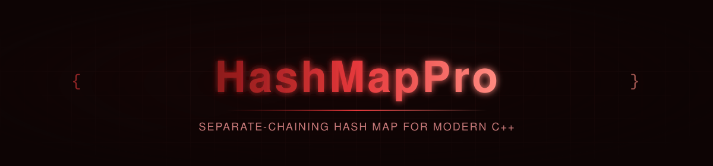

<p align="center">
  
</p>

<p align="center">
  
  
  
</p>

<p align="center">
  
</p>

<p align="center"><sub><b>CI / CD</b></sub></p>
<p align="center">
  <a href="https://github.com/privateMwb/HashMapPro/actions/workflows/build.yml">
    
  </a>
  <a href="https://github.com/privateMwb/HashMapPro/actions/workflows/benchmark.yml">
    
  </a>
  <a href="https://github.com/privateMwb/HashMapPro/actions/workflows/packaging.yml">
    
  </a>
  <a href="https://github.com/privateMwb/HashMapPro/actions/workflows/release.yml">
    
  </a>
</p>

<p align="center"><sub><b>Code Quality &amp; Safety</b></sub></p>
<p align="center">
  <a href="https://github.com/privateMwb/HashMapPro/actions/workflows/coverage.yml">
    
  </a>
  <a href="https://github.com/privateMwb/HashMapPro/actions/workflows/sanitizers.yml">
    
  </a>
  <a href="https://github.com/privateMwb/HashMapPro/actions/workflows/clang-tidy.yml">
    
  </a>
  <a href="https://github.com/privateMwb/HashMapPro/actions/workflows/clang-format.yml">
    
  </a>
  <a href="https://github.com/privateMwb/HashMapPro/actions/workflows/codeql.yml">
    
  </a>
  <a href="https://github.com/privateMwb/HashMapPro/actions/workflows/cflite_pr.yml">
    
  </a>
  <a href="https://www.bestpractices.dev/projects/14696">
    
  </a>
</p>

<p align="center"><sub><b>Documentation</b></sub></p>
<p align="center">
  <a href="https://github.com/privateMwb/HashMapPro/actions/workflows/docs.yml">
    
  </a>
</p>

<p align="center">
  
</p>

<p align="center"><sub><b>Compiler Support</b></sub></p>
<p align="center">
  
  
  
  
</p>

<p align="center">
  
</p>

<p align="center">HashMapPro is a header-only, separate-chaining hash map for modern C++ — power-of-two bucket sizing with bitmask indexing, automatic rehashing, lazily-allocated storage that lets a moved-from map be safely reused, and a custom-hash-functor-friendly API, so you only pay for the parts you actually use.</p>

<br>

## 📑 Table of Contents

- [Features](#features)
- [Requirements](#requirements)
- [Installation](#installation)
- [Quick Start](#quick-start)
- [Project Structure](#project-structure)
- [Development](#development)
- [Benchmarks](#benchmarks)
- [Fuzzing](#fuzzing)
- [Documentation](#documentation)
- [Contributing](#contributing)
- [Changelog](#changelog)
- [Security](#security)
- [License](#license)

<br>

## <a id="features"></a>✨ Features

- **Automatic power-of-two rehashing** — bucket count is always kept a power of two, so lookups use bitmask indexing (`hash & (capacity - 1)`) instead of a division/modulo, and the table grows automatically once `load_factor()` exceeds 0.75 (`max_load_factor()`), relinking existing nodes in place rather than reallocating or copying elements.
- **Lazily-allocated, reusable storage** — a moved-from `HashMap` holds no bucket array at all rather than a dangling one; `ensureStorage()` transparently reallocates on the next write, so the moved-from instance stays safely reusable instead of only destructible or assignable.
- **Three distinct, deliberately separate write paths** — `insert()` (no-op if the key is already present), `operator[]` (insert-or-default, then assign), and `update()` (updates only if the key is already present), rather than folding all three into one ambiguous "upsert."
- **Exception-safe cloning** — `cloneFrom()` copies elements directly from a known-unique key set during copy construction/assignment, turning what would otherwise be an O(n × average chain length) copy via `insert()` into a straight O(n) copy, with the hasher assigned before cloning ever begins.
- **Custom key types via a user-supplied `Hash` functor** — the third template parameter defaults to `std::hash<K>` but accepts any callable, so keys beyond the built-in hashable types are a template argument away rather than a fork.

<div align="right"><a href="#-table-of-contents"></a></div>

## <a id="requirements"></a>📋 Requirements

- A C++20-conformant compiler (tested: GCC, Clang, MSVC, AppleClang)
- CMake 3.20+

<div align="right"><a href="#-table-of-contents"></a></div>

## <a id="installation"></a>📦 Installation

**From source:**

```bash
git clone https://github.com/privateMwb/HashMapPro.git
cd HashMapPro
cmake -B build \
  -DBUILD_TESTS=OFF \
  -DBUILD_BENCHMARKS=OFF \
  -DBUILD_REGRESSION=OFF \
  -DBUILD_EXAMPLES=OFF
cmake --install build
```

Then, in your own `CMakeLists.txt`:

```cmake
find_package(HashMapPro CONFIG REQUIRED)
target_link_libraries(your_target PRIVATE HashMapPro::HashMapPro)
```

> vcpkg and Conan packages are built and verified (recipe in
> `packaging/recipes/hashmappro/`, port in `packaging/vcpkg/ports/hashmappro/`),
> but not yet published to the public registries. This section will be
> updated once they are.

<div align="right"><a href="#-table-of-contents"></a></div>

## <a id="quick-start"></a>🚀 Quick Start

```cpp
#include <HashMapPro/HashMap.h>

int main() {
    HashMapPro::HashMap<std::string, int> ages;

    ages.insert("Alice", 30);
    ages.insert("Bob", 25);
    ages["Charlie"] = 40; // operator[] inserts a default value if absent

    if (ages.contains("Alice")) {
        std::cout << ages.at("Alice") << '\n';
    }

    ages.update("Bob", 26); // only updates -- no-op if "Bob" weren't present
    ages.erase("Charlie");

    for (const auto& node : ages) {
        // range-for works via begin()/end(); node.key / node.value
        std::cout << node.key << " -> " << node.value << '\n';
    }
}
```

A custom hash functor for keys beyond the built-in hashable types:

```cpp
struct CaseInsensitiveHash {
    std::size_t operator()(const std::string& key) const noexcept {
        std::string lower = key;
        std::transform(lower.begin(), lower.end(), lower.begin(), ::tolower);
        return std::hash<std::string>{}(lower);
    }
};

HashMapPro::HashMap<std::string, int, CaseInsensitiveHash> scores(64);
```

Reserving capacity ahead of a bulk insert, and bounds-checked access:

```cpp
HashMapPro::HashMap<int, int> counts;
counts.reserve(1000); // avoids rehashing partway through the loop below

for (int i = 0; i < 1000; ++i) {
    counts.insert(i, i * i);
}

try {
    counts.at(-1); // out of range -- key not present
} catch (const std::out_of_range& e) {
    std::cerr << e.what() << '\n';
}
```

<div align="right"><a href="#-table-of-contents"></a></div>

## <a id="project-structure"></a>🗂️ Project Structure

```
HashMapPro/
├── include/
│   └── HashMapPro/
│       ├── HashMap.h
│       ├── HashMap.tpp
│       ├── Iterator.h
│       └── Node.h
│
├── tests/
│   ├── custom/
│   ├── google/
│   ├── CMakeLists.txt
│   └── README.md
│
├── benchmarks/
│   ├── baselines/
│   ├── custom/
│   ├── google/
│   ├── result/
│   ├── CMakeLists.txt
│   └── README.md
│
├── examples/
│   ├── support/
│   ├── suite/
│   ├── example_main.cpp
│   ├── CMakeLists.txt
│   └── README.md
│
├── regression/
│   ├── custom/
│   ├── google/
│   ├── results/
│   ├── CMakeLists.txt
│   └── README.md
│
├── fuzz/
│   └── fuzz_hashmap.cpp
│
├── .clusterfuzzlite/
│   ├── Dockerfile
│   ├── build.sh
│   └── project.yaml
│
├── packaging/
│   ├── README.md
│   ├── requirements.in
│   ├── requirements.txt
│   ├── recipes/
│   ├── vcpkg/
│   └── vcpkg-smoke-test/
│
├── scripts/
│   └── update_package_files.py
│
├── .github/
│   ├── assets/
│   ├── releases/
│   ├── workflows/
│   ├── CODEOWNERS
│   └── dependabot.yml
│
├── cmake/
│   └── HashMapProConfig.cmake.in
│
├── docs/
│   ├── Doxyfile
│   └── README.md
│
├── .clang-format
├── .clang-tidy
├── .gitignore
├── CMakeLists.txt
├── README.md
├── CONTRIBUTING.md
├── CHANGELOG.md
├── SECURITY.md
├── FUZZING.md
└── LICENSE
```

<div align="right"><a href="#-table-of-contents"></a></div>

## <a id="development"></a>🛠️ Development

The from-source install above builds the library only. To work on
HashMapPro itself — running tests, benchmarks, or the regression tool —
build with everything enabled (the default):

```bash
cmake -B build
cmake --build build
```

**Run the test suite:**

```bash
ctest --test-dir build
```

**Run benchmarks and check for regressions:**

```bash
./build/benchmarks
./build/regression                     # latest baseline vs. benchmarks/results/benchmark_results.json
./build/regression v1.0.0              # a specific baseline vs. current
./build/regression v1.0.0 <other-tag>  # two baselines against each other
```

`regression` picks the latest baseline by semantic version (`v1.10.0`
correctly outranks `v1.9.0`), not alphabetical filename order, and
auto-names its output (`regression_v1.0.0_vs_current.md`/`.json`, etc.).

See [packaging/README.md](packaging/README.md) for notes on verifying the vcpkg
port and Conan recipe locally.

<div align="right"><a href="#-table-of-contents"></a></div>

## <a id="benchmarks"></a>📊 Benchmarks

Measured against `std::unordered_map`, same build, at 10K / 100K / 1M
iterations (`benchmarks/baselines/v1.0.0.json` has the full dataset).

*Environment: 4-core CI runner @ 3.26 GHz, 32 KiB L1 / 512 KiB L2 / 32 MiB
L3, Release build — see the `context` block in
`benchmarks/baselines/v1.0.0.json` for the exact machine and library
version each run was captured on.*

| Operation | HashMapPro (1M) | std::unordered_map (1M) | Δ |
|---|---|---|---|
| `Insert() Existing` | 2.29 ms | 14.63 ms | +538.3% |
| `Contains() Hit` | 934.05 us | 2.17 ms | +132.7% |
| `Update() Existing` | 988.29 us | 2.30 ms | +132.3% |
| `At() Existing` | 939.44 us | 2.17 ms | +131.4% |
| `Insert() New` | 1.36 s | 2.82 s | +107.0% |
| `Erase() Missing` | 1.34 s | 2.68 s | +99.6% |
| `Clear() Populated` | 1.40 s | 2.64 s | +88.5% |
| `Move Construct` | 2.30 s | 4.26 s | +85.6% |
| `Find() Hit` | 1.25 ms | 2.17 ms | +73.4% |
| `Copy Construct` | 2.88 s | 2.93 s | +1.8% |
| `Reserved Construct` | 150.24 ms | 37.85 ms | -74.8% |
| `Copy Assignment` | 2.61 s | 256.05 ms | -90.2% |

HashMapPro's bitmask-indexed, separate-chaining design pays off most on
no-op paths that skip real work (`Insert() Existing` short-circuits on
the first matching node without allocating), and on the ordinary
hit/miss lookups (`Contains()`, `At()`, `Update()`, `Find()`) that
dominate typical usage.

The trade-off: bucket storage is allocated lazily but grows by full
reallocation, so operations that touch every element under a fresh
allocation — `Reserved Construct`, and especially `Copy Assignment`,
which releases the destination before cloning — pay that cost directly
rather than amortizing it the way `std::unordered_map`'s node-based
allocator does.

<div align="right"><a href="#-table-of-contents"></a></div>

## <a id="fuzzing"></a>🐛 Fuzzing

`HashMap<int, int>` is continuously fuzzed via
[ClusterFuzzLite](https://google.github.io/clusterfuzzlite/):
differential testing against a `std::unordered_map<int, int>` shadow
model, under AddressSanitizer and UndefinedBehaviorSanitizer. A short
pass runs on every PR touching `HashMap`'s implementation; a longer
pass runs nightly.

This covers bucket-chaining and lookup correctness under heavy
collisions, the power-of-two bucket sizing / 0.75-load-factor rehash
contract, `insert()`/`operator[]`/`update()`'s three distinct write
semantics, `erase()`'s unlink logic, `at()`'s bounds-checking contract,
both `operator=` overloads including self-assignment and self-move,
and reuse of a moved-from map via `ensureStorage()`. Custom hash
functors and exception-injection during copy construction aren't
covered yet — see [FUZZING.md](FUZZING.md) for full scope, running
locally, and reproducing a failing input.

<div align="right"><a href="#-table-of-contents"></a></div>

## <a id="documentation"></a>📖 Documentation

Full API reference, generated with Doxygen from `docs/Doxyfile`:

**https://privateMwb.github.io/HashMapPro/**

<div align="right"><a href="#-table-of-contents"></a></div>

## <a id="contributing"></a>🤝 Contributing

Issues and pull requests are welcome — see [CONTRIBUTING.md](CONTRIBUTING.md)
for the full process, coding standard reference, and what CI checks on
every PR. Short version, before submitting:

- Run the test suite (`ctest --test-dir build`)
- If you're changing a hot path, run `./build/regression` and mention
  the results in your PR description

<div align="right"><a href="#-table-of-contents"></a></div>

## <a id="changelog"></a>📝 Changelog

See [CHANGELOG.md](CHANGELOG.md) for a curated, per-release summary of
changes, or the [Releases](https://github.com/privateMwb/HashMapPro/releases)
page for the full release notes.

<div align="right"><a href="#-table-of-contents"></a></div>

## <a id="security"></a>🔒 Security

See [SECURITY.md](SECURITY.md) for the supported versions, how to report
a vulnerability (including privately, via GitHub Security Advisories),
and the disclosure timeline.

<div align="right"><a href="#-table-of-contents"></a></div>

## <a id="license"></a>📄 License

MIT — see [LICENSE](LICENSE) for details.

<p align="center">
  <sub>Built with C++20</sub>
</p>

<p align="center">
  <a href="#-table-of-contents"></a>
</p>
